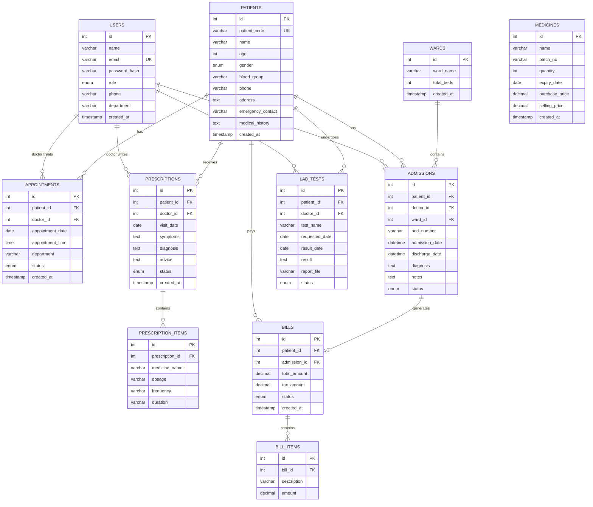

# 🏥 Hospital Management System

## 📋 Project Information

| Field | Details |
|-------|---------|
| **Student Name** | Sarang Kadam |
| **Roll No** | 125 |
| **Class** | TY CSE (A) |
| **Project Title** | Hospital Management System |
| **Subject** | Database Management System |
| **GitHub Link** | https://github.com/sarang-sketch/SarangKadam_125_TYCSEA_HospitalManagementSystem-.git |

---

## 📖 Table of Contents

1. [Project Overview](#project-overview)
2. [Features](#features)
3. [Technology Stack](#technology-stack)
4. [Database Design](#database-design)
5. [ER Diagram](#er-diagram)
6. [Schema Diagram](#schema-diagram)
7. [Normalization](#normalization)
8. [Setup Instructions](#setup-instructions)
9. [Usage Guide](#usage-guide)
10. [Project Structure](#project-structure)

---

## 🎯 Project Overview

The Hospital Management System (HMS) is a comprehensive web-based application designed to streamline hospital operations. Built using PHP and MySQL, it provides role-based access control for different hospital staff members and manages all aspects of hospital administration including patient records, appointments, admissions, prescriptions, lab tests, billing, and pharmacy inventory.

### Objectives
- Automate hospital administrative processes
- Maintain accurate patient records
- Streamline appointment scheduling
- Manage billing and payments efficiently
- Track medicine inventory
- Generate reports for management

---

## ✨ Features

### 👥 User Roles & Authentication
| Role | Access Level |
|------|--------------|
| **Admin** | Full system access, user & ward management |
| **Doctor** | Appointments, prescriptions, lab requests |
| **Nurse** | Patient care, admission notes |
| **Receptionist** | Patient registration, appointments, billing |
| **Lab Technician** | Test results, report uploads |
| **Pharmacist** | Prescription dispensing, inventory |

### 📦 Core Modules
- ✅ **Patient Management** - Registration, Search, Medical History
- ✅ **Appointment Booking** - Schedule, Reschedule, Cancel
- ✅ **IPD Management** - Admissions, Ward/Bed Allocation, Discharge
- ✅ **Prescription System** - Create, Print, Track Dispensing
- ✅ **Lab Tests** - Request, Results Entry, PDF Uploads
- ✅ **Billing** - Itemized Bills, Tax Calculation, Invoices
- ✅ **Pharmacy** - Medicine Inventory, Stock Alerts
- ✅ **Ward Management** - Bed Availability Tracking

### 🔒 Security Features
- Password hashing using bcrypt
- SQL injection prevention (prepared statements)
- XSS protection (output escaping)
- Session-based authentication
- Role-based access control

---

## 🛠️ Technology Stack

| Component | Technology |
|-----------|------------|
| **Backend** | PHP 8.0+ |
| **Database** | MySQL 5.7+ / MariaDB |
| **Frontend** | HTML5, CSS3, JavaScript |
| **UI Framework** | Bootstrap 5.3 |
| **Icons** | Font Awesome 6 |
| **Server** | Apache (XAMPP) |

---

## 🗄️ Database Design

### Database Tables (11 Tables)

| # | Table Name | Description | Primary Key |
|---|------------|-------------|-------------|
| 1 | `users` | System users with roles | id |
| 2 | `patients` | Patient records | id |
| 3 | `appointments` | Scheduled appointments | id |
| 4 | `admissions` | IPD admissions | id |
| 5 | `wards` | Hospital wards | id |
| 6 | `prescriptions` | Doctor prescriptions | id |
| 7 | `prescription_items` | Medicines in prescriptions | id |
| 8 | `lab_tests` | Lab test requests & results | id |
| 9 | `bills` | Patient bills | id |
| 10 | `bill_items` | Itemized charges | id |
| 11 | `medicines` | Pharmacy inventory | id |

### Table Structures

#### 1. Users Table
```sql
CREATE TABLE users (
    id INT AUTO_INCREMENT PRIMARY KEY,
    name VARCHAR(100) NOT NULL,
    email VARCHAR(100) NOT NULL UNIQUE,
    password_hash VARCHAR(255) NOT NULL,
    role ENUM('admin','doctor','nurse','receptionist','lab','pharmacist') NOT NULL,
    phone VARCHAR(20),
    department VARCHAR(50),
    created_at TIMESTAMP DEFAULT CURRENT_TIMESTAMP
);
```

#### 2. Patients Table
```sql
CREATE TABLE patients (
    id INT AUTO_INCREMENT PRIMARY KEY,
    patient_code VARCHAR(20) NOT NULL UNIQUE,
    name VARCHAR(100) NOT NULL,
    age INT NOT NULL,
    gender ENUM('male','female','other') NOT NULL,
    blood_group VARCHAR(5),
    phone VARCHAR(20) NOT NULL,
    address TEXT,
    emergency_contact VARCHAR(100),
    medical_history TEXT,
    created_at TIMESTAMP DEFAULT CURRENT_TIMESTAMP
);
```

#### 3. Appointments Table
```sql
CREATE TABLE appointments (
    id INT AUTO_INCREMENT PRIMARY KEY,
    patient_id INT NOT NULL,
    doctor_id INT NOT NULL,
    appointment_date DATE NOT NULL,
    appointment_time TIME NOT NULL,
    department VARCHAR(50),
    status ENUM('pending','completed','cancelled') DEFAULT 'pending',
    created_at TIMESTAMP DEFAULT CURRENT_TIMESTAMP,
    FOREIGN KEY (patient_id) REFERENCES patients(id),
    FOREIGN KEY (doctor_id) REFERENCES users(id)
);
```

#### 4. Admissions Table
```sql
CREATE TABLE admissions (
    id INT AUTO_INCREMENT PRIMARY KEY,
    patient_id INT NOT NULL,
    doctor_id INT NOT NULL,
    ward_id INT NOT NULL,
    bed_number VARCHAR(10) NOT NULL,
    admission_date DATETIME NOT NULL,
    discharge_date DATETIME,
    diagnosis TEXT,
    notes TEXT,
    status ENUM('admitted','discharged') DEFAULT 'admitted',
    FOREIGN KEY (patient_id) REFERENCES patients(id),
    FOREIGN KEY (doctor_id) REFERENCES users(id),
    FOREIGN KEY (ward_id) REFERENCES wards(id)
);
```

#### 5. Wards Table
```sql
CREATE TABLE wards (
    id INT AUTO_INCREMENT PRIMARY KEY,
    ward_name VARCHAR(50) NOT NULL,
    total_beds INT NOT NULL DEFAULT 0,
    created_at TIMESTAMP DEFAULT CURRENT_TIMESTAMP
);
```

#### 6. Prescriptions Table
```sql
CREATE TABLE prescriptions (
    id INT AUTO_INCREMENT PRIMARY KEY,
    patient_id INT NOT NULL,
    doctor_id INT NOT NULL,
    visit_date DATE NOT NULL,
    symptoms TEXT,
    diagnosis TEXT,
    advice TEXT,
    status ENUM('pending','dispensed') DEFAULT 'pending',
    created_at TIMESTAMP DEFAULT CURRENT_TIMESTAMP,
    FOREIGN KEY (patient_id) REFERENCES patients(id),
    FOREIGN KEY (doctor_id) REFERENCES users(id)
);
```

#### 7. Prescription Items Table
```sql
CREATE TABLE prescription_items (
    id INT AUTO_INCREMENT PRIMARY KEY,
    prescription_id INT NOT NULL,
    medicine_name VARCHAR(100) NOT NULL,
    dosage VARCHAR(50),
    frequency VARCHAR(50),
    duration VARCHAR(50),
    FOREIGN KEY (prescription_id) REFERENCES prescriptions(id)
);
```

#### 8. Lab Tests Table
```sql
CREATE TABLE lab_tests (
    id INT AUTO_INCREMENT PRIMARY KEY,
    patient_id INT NOT NULL,
    doctor_id INT NOT NULL,
    test_name VARCHAR(100) NOT NULL,
    requested_date DATE NOT NULL,
    result_date DATE,
    result TEXT,
    report_file VARCHAR(255),
    status ENUM('requested','in-progress','completed') DEFAULT 'requested',
    FOREIGN KEY (patient_id) REFERENCES patients(id),
    FOREIGN KEY (doctor_id) REFERENCES users(id)
);
```

#### 9. Bills Table
```sql
CREATE TABLE bills (
    id INT AUTO_INCREMENT PRIMARY KEY,
    patient_id INT NOT NULL,
    admission_id INT,
    total_amount DECIMAL(10,2) NOT NULL DEFAULT 0,
    tax_amount DECIMAL(10,2) DEFAULT 0,
    status ENUM('paid','unpaid') DEFAULT 'unpaid',
    created_at TIMESTAMP DEFAULT CURRENT_TIMESTAMP,
    FOREIGN KEY (patient_id) REFERENCES patients(id),
    FOREIGN KEY (admission_id) REFERENCES admissions(id)
);
```

#### 10. Bill Items Table
```sql
CREATE TABLE bill_items (
    id INT AUTO_INCREMENT PRIMARY KEY,
    bill_id INT NOT NULL,
    description VARCHAR(255) NOT NULL,
    amount DECIMAL(10,2) NOT NULL,
    FOREIGN KEY (bill_id) REFERENCES bills(id)
);
```

#### 11. Medicines Table
```sql
CREATE TABLE medicines (
    id INT AUTO_INCREMENT PRIMARY KEY,
    name VARCHAR(100) NOT NULL,
    batch_no VARCHAR(50),
    quantity INT NOT NULL DEFAULT 0,
    expiry_date DATE,
    purchase_price DECIMAL(10,2),
    selling_price DECIMAL(10,2),
    created_at TIMESTAMP DEFAULT CURRENT_TIMESTAMP
);
```

---

## 📊 ER Diagram



---

## 📐 Schema Diagram

```mermaid
flowchart TB
    subgraph Core["🏥 Core Entities"]
        USERS["<b>USERS</b><br/>id, name, email, password_hash,<br/>role, phone, department, created_at"]
        PATIENTS["<b>PATIENTS</b><br/>id, patient_code, name, age, gender,<br/>blood_group, phone, address,<br/>emergency_contact, medical_history"]
        WARDS["<b>WARDS</b><br/>id, ward_name, total_beds"]
    end
    
    subgraph Clinical["💊 Clinical Operations"]
        APPOINTMENTS["<b>APPOINTMENTS</b><br/>id, patient_id, doctor_id,<br/>date, time, department, status"]
        ADMISSIONS["<b>ADMISSIONS</b><br/>id, patient_id, doctor_id, ward_id,<br/>bed_number, admission_date,<br/>discharge_date, diagnosis, status"]
        PRESCRIPTIONS["<b>PRESCRIPTIONS</b><br/>id, patient_id, doctor_id,<br/>visit_date, symptoms,<br/>diagnosis, advice, status"]
        PRESCRIPTION_ITEMS["<b>PRESCRIPTION_ITEMS</b><br/>id, prescription_id, medicine_name,<br/>dosage, frequency, duration"]
        LAB_TESTS["<b>LAB_TESTS</b><br/>id, patient_id, doctor_id,<br/>test_name, requested_date,<br/>result_date, result, status"]
    end
    
    subgraph Financial["💰 Financial"]
        BILLS["<b>BILLS</b><br/>id, patient_id, admission_id,<br/>total_amount, tax_amount, status"]
        BILL_ITEMS["<b>BILL_ITEMS</b><br/>id, bill_id, description, amount"]
    end
    
    subgraph Inventory["📦 Inventory"]
        MEDICINES["<b>MEDICINES</b><br/>id, name, batch_no, quantity,<br/>expiry_date, purchase_price,<br/>selling_price"]
    end
    
    USERS -->|doctor_id| APPOINTMENTS
    USERS -->|doctor_id| ADMISSIONS
    USERS -->|doctor_id| PRESCRIPTIONS
    USERS -->|doctor_id| LAB_TESTS
    
    PATIENTS -->|patient_id| APPOINTMENTS
    PATIENTS -->|patient_id| ADMISSIONS
    PATIENTS -->|patient_id| PRESCRIPTIONS
    PATIENTS -->|patient_id| LAB_TESTS
    PATIENTS -->|patient_id| BILLS
    
    WARDS -->|ward_id| ADMISSIONS
    ADMISSIONS -->|admission_id| BILLS
    
    PRESCRIPTIONS -->|prescription_id| PRESCRIPTION_ITEMS
    BILLS -->|bill_id| BILL_ITEMS
```



### Relational Schema Notation

```
USERS (id, name, email, password_hash, role, phone, department, created_at)
PATIENTS (id, patient_code, name, age, gender, blood_group, phone, address, emergency_contact, medical_history, created_at)
WARDS (id, ward_name, total_beds, created_at)
APPOINTMENTS (id, patient_id*, doctor_id*, appointment_date, appointment_time, department, status, created_at)
ADMISSIONS (id, patient_id*, doctor_id*, ward_id*, bed_number, admission_date, discharge_date, diagnosis, notes, status)
PRESCRIPTIONS (id, patient_id*, doctor_id*, visit_date, symptoms, diagnosis, advice, status, created_at)
PRESCRIPTION_ITEMS (id, prescription_id*, medicine_name, dosage, frequency, duration)
LAB_TESTS (id, patient_id*, doctor_id*, test_name, requested_date, result_date, result, report_file, status)
BILLS (id, patient_id*, admission_id*, total_amount, tax_amount, status, created_at)
BILL_ITEMS (id, bill_id*, description, amount)
MEDICINES (id, name, batch_no, quantity, expiry_date, purchase_price, selling_price, created_at)

Note: * denotes Foreign Key
```

---

## � Darta Flow Diagram

```mermaid
flowchart LR
    subgraph External["External Entities"]
        P[("👤 Patient")]
        D[("👨‍⚕️ Doctor")]
        A[("👨‍💼 Admin")]
        R[("💁 Receptionist")]
        L[("🔬 Lab Tech")]
        PH[("💊 Pharmacist")]
    end
    
    subgraph HMS["🏥 Hospital Management System"]
        direction TB
        AUTH["1.0<br/>Authentication"]
        PM["2.0<br/>Patient<br/>Management"]
        APT["3.0<br/>Appointment<br/>Scheduling"]
        ADM["4.0<br/>Admission<br/>Management"]
        RX["5.0<br/>Prescription<br/>Management"]
        LAB["6.0<br/>Lab Test<br/>Management"]
        BILL["7.0<br/>Billing<br/>System"]
        INV["8.0<br/>Inventory<br/>Management"]
    end
    
    subgraph DataStores["Data Stores"]
        DS1[("D1: Users")]
        DS2[("D2: Patients")]
        DS3[("D3: Appointments")]
        DS4[("D4: Admissions")]
        DS5[("D5: Prescriptions")]
        DS6[("D6: Lab Tests")]
        DS7[("D7: Bills")]
        DS8[("D8: Medicines")]
    end
    
    P -->|Registration| PM
    R -->|Register Patient| PM
    PM -->|Patient Data| DS2
    
    R -->|Book Appointment| APT
    D -->|View Schedule| APT
    APT -->|Appointment Data| DS3
    
    R -->|Admit Patient| ADM
    ADM -->|Admission Data| DS4
    
    D -->|Create Prescription| RX
    RX -->|Prescription Data| DS5
    
    D -->|Request Test| LAB
    L -->|Enter Results| LAB
    LAB -->|Test Data| DS6
    
    R -->|Generate Bill| BILL
    BILL -->|Bill Data| DS7
    
    PH -->|Update Stock| INV
    INV -->|Medicine Data| DS8
    
    A -->|Manage Users| AUTH
    AUTH -->|User Data| DS1
```



---

## 📏 Normalization

### First Normal Form (1NF)
- All tables have primary keys
- All attributes contain atomic values
- No repeating groups

### Second Normal Form (2NF)
- All tables are in 1NF
- All non-key attributes are fully dependent on the primary key
- No partial dependencies

### Third Normal Form (3NF)
- All tables are in 2NF
- No transitive dependencies
- All non-key attributes depend only on the primary key

### Functional Dependencies

```
USERS:
  id → name, email, password_hash, role, phone, department, created_at

PATIENTS:
  id → patient_code, name, age, gender, blood_group, phone, address, 
       emergency_contact, medical_history, created_at

APPOINTMENTS:
  id → patient_id, doctor_id, appointment_date, appointment_time, 
       department, status, created_at

ADMISSIONS:
  id → patient_id, doctor_id, ward_id, bed_number, admission_date,
       discharge_date, diagnosis, notes, status

PRESCRIPTIONS:
  id → patient_id, doctor_id, visit_date, symptoms, diagnosis, advice, status

PRESCRIPTION_ITEMS:
  id → prescription_id, medicine_name, dosage, frequency, duration

LAB_TESTS:
  id → patient_id, doctor_id, test_name, requested_date, result_date,
       result, report_file, status

BILLS:
  id → patient_id, admission_id, total_amount, tax_amount, status, created_at

BILL_ITEMS:
  id → bill_id, description, amount

WARDS:
  id → ward_name, total_beds, created_at

MEDICINES:
  id → name, batch_no, quantity, expiry_date, purchase_price, selling_price
```

---

## ⚙️ Setup Instructions

### Prerequisites
1. Install [XAMPP](https://www.apachefriends.org/) (Apache + MySQL + PHP 8+)
2. Web browser (Chrome, Firefox, Edge)

### Installation Steps

**Step 1: Download/Clone Project**
```bash
git clone https://github.com/sarang-sketch/SarangKadam_125_TYCSEA_HospitalManagementSystem-.git
```

**Step 2: Copy to XAMPP**
```
Copy folder to: C:\xampp\htdocs\SarangKadam_125_TYCSEA_HospitalManagementSystem
```

**Step 3: Start XAMPP Services**
- Open XAMPP Control Panel
- Start **Apache**
- Start **MySQL**

**Step 4: Import Database**
1. Open http://localhost/phpmyadmin
2. Click **"Import"** tab
3. Select `db.sql` file
4. Click **"Go"**

**Step 5: Configure Database** (if needed)
Edit `config/database.php`:
```php
define('DB_HOST', 'localhost');
define('DB_USER', 'root');
define('DB_PASS', '');
define('DB_NAME', 'hospital_management');
```

**Step 6: Access System**
```
http://localhost/SarangKadam_125_TYCSEA_HospitalManagementSystem
```

---

## 🔑 Login Credentials

| Role | Email | Password |
|------|-------|----------|
| Admin | admin@hospital.com | Admin@123 |
| Doctor | doctor1@hospital.com | Admin@123 |
| Doctor | doctor2@hospital.com | Admin@123 |
| Nurse | nurse@hospital.com | Admin@123 |
| Receptionist | reception@hospital.com | Admin@123 |
| Lab Tech | lab@hospital.com | Admin@123 |
| Pharmacist | pharmacy@hospital.com | Admin@123 |

---

## 📖 Usage Guide

### Admin Functions
1. Login → Dashboard with statistics
2. User Management → Add/Edit/Delete users
3. Ward Management → Configure wards and beds

### Receptionist Functions
1. Register new patients
2. Book appointments
3. Manage admissions/discharges
4. Generate bills

### Doctor Functions
1. View appointments
2. Create prescriptions
3. Request lab tests
4. View patient history

### Pharmacist Functions
1. View pending prescriptions
2. Dispense medicines
3. Manage inventory

---

## 📁 Project Structure

```
SarangKadam_125_TYCSEA_HospitalManagementSystem/
├── admin/              # Admin module
├── doctor/             # Doctor module
├── nurse/              # Nurse module
├── receptionist/       # Receptionist module
├── lab/                # Lab technician module
├── pharmacist/         # Pharmacist module
├── billing/            # Billing module
├── auth/               # Authentication
├── config/             # Database config
├── includes/           # Shared components
├── assets/             # CSS, JS, images
├── uploads/            # File uploads
├── db.sql              # Database schema
├── requirements.txt    # Requirements
├── README.md           # Documentation
└── Project_Report.pdf  # Final report
```

---

## 📊 Sample Data Included

- 7 Users (Admin, 2 Doctors, Nurse, Receptionist, Lab Tech, Pharmacist)
- 10 Sample Patients
- 5 Wards (General, ICU, Pediatric, Maternity, Emergency)
- Sample Appointments, Prescriptions, Lab Tests, Bills
- 12 Medicines in Inventory

---

## 👨‍💻 Developer Information

| Field | Details |
|-------|---------|
| **Name** | Sarang Kadam |
| **Roll No** | 125 |
| **Class** | TY CSE (A) |
| **Project** | Hospital Management System |
| **Subject** | Database Management System |

---

## 🔗 Repository

**GitHub:** https://github.com/sarang-sketch/SarangKadam_125_TYCSEA_HospitalManagementSystem-.git

---

© 2025 Hospital Management System | Sarang Kadam | Roll No: 125 | TY CSE (A)
