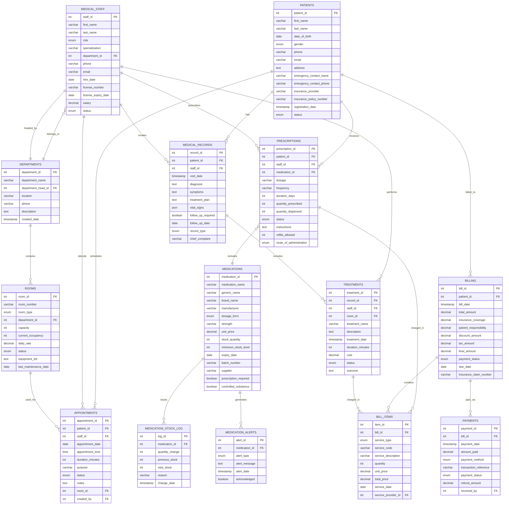

# 🏥 Hospital Management System - Database Diagrams

## 📋 Project Information

| Field | Details |
|-------|---------|
| **Student Name** | Sarang Kadam |
| **Roll No** | 125 |
| **Class** | TY CSE (A) |
| **Project Title** | Hospital Management System |
| **Subject** | Database Management System |

---

## 📊 Entity Relationship Diagram (ERD)

### Complete ER Diagram

---

## 🔗 Relationship Cardinality Summary

| Parent Entity | Child Entity | Relationship | Cardinality |
|---------------|--------------|--------------|-------------|
| PATIENTS | APPOINTMENTS | Patient schedules appointments | 1:N |
| PATIENTS | MEDICAL_RECORDS | Patient has medical records | 1:N |
| PATIENTS | PRESCRIPTIONS | Patient receives prescriptions | 1:N |
| PATIENTS | BILLING | Patient receives bills | 1:N |
| MEDICAL_STAFF | APPOINTMENTS | Staff attends appointments | 1:N |
| MEDICAL_STAFF | MEDICAL_RECORDS | Staff creates records | 1:N |
| MEDICAL_STAFF | PRESCRIPTIONS | Staff prescribes medications | 1:N |
| MEDICAL_STAFF | TREATMENTS | Staff performs treatments | 1:N |
| DEPARTMENTS | MEDICAL_STAFF | Department has staff | 1:N |
| DEPARTMENTS | ROOMS | Department contains rooms | 1:N |
| ROOMS | APPOINTMENTS | Room used for appointments | 1:N |
| MEDICATIONS | PRESCRIPTIONS | Medication in prescriptions | 1:N |
| BILLING | BILL_ITEMS | Bill contains items | 1:N |
| BILLING | PAYMENTS | Bill has payments | 1:N |
| MEDICAL_RECORDS | TREATMENTS | Record includes treatments | 1:N |

---

## 📐 Relational Schema Diagram

---
