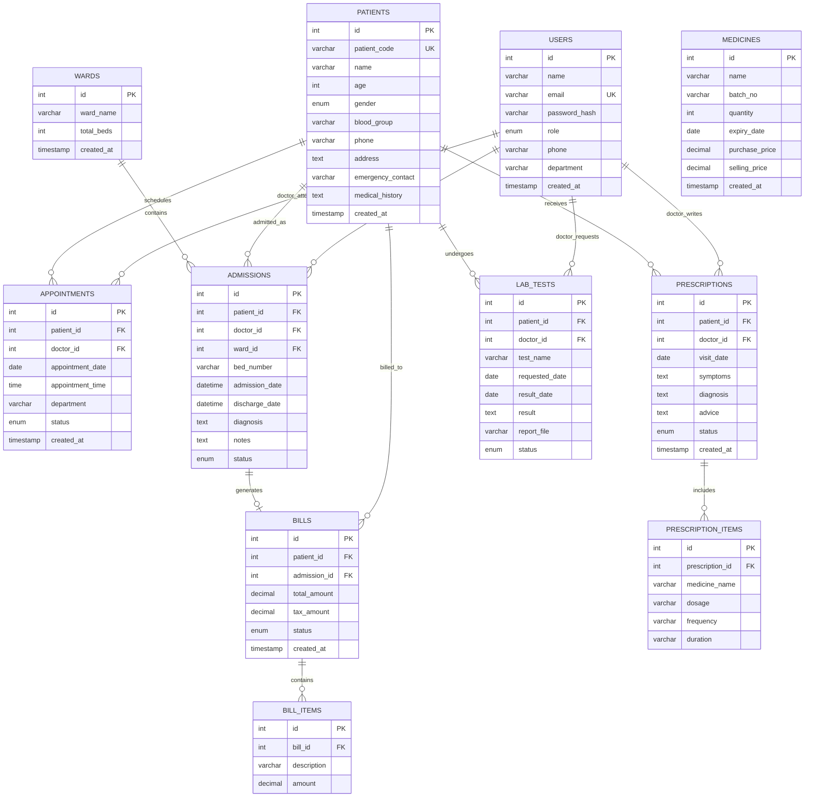
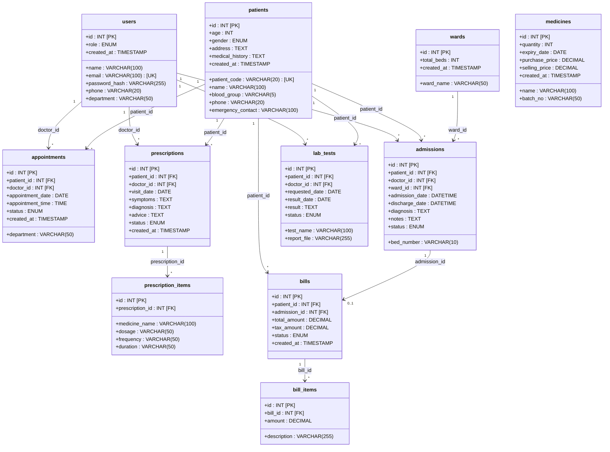
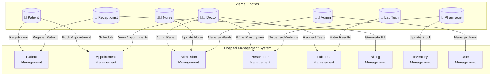
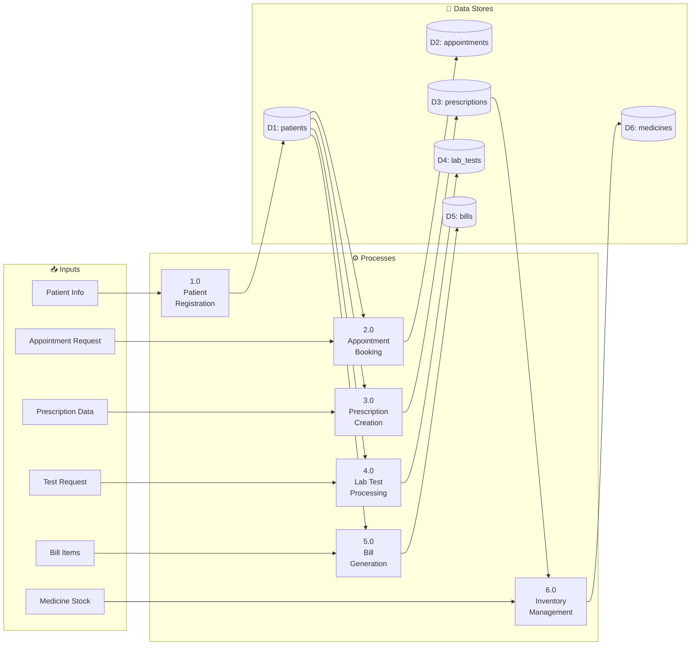

# 🏥 Hospital Management System

<div align="center">


**A comprehensive web-based Hospital Management System built with PHP and MySQL**

[Features](#-features) • [Installation](#-installation) • [Database Design](#-database-design) • [ER Diagram](#-er-diagram) • [Screenshots](#-screenshots)

</div>

---

## 📋 Project Information

| Field | Details |
|:------|:--------|
| **Student Name** | Sarang Kadam |
| **Roll No** | 125 |
| **Class** | TY CSE (A) |
| **Project Title** | Hospital Management System |
| **Subject** | Database Management System |
| **GitHub** | [Repository Link](https://github.com/sarang-sketch/SarangKadam_125_TYCSEA_HospitalManagementSystem) |

---

## 🎯 Project Overview

The Hospital Management System (HMS) is a comprehensive web-based application designed to streamline hospital operations. Built using PHP and MySQL, it provides role-based access control for different hospital staff members and manages all aspects of hospital administration including:

- 👥 Patient Records Management
- 📅 Appointment Scheduling
- 🏥 IPD/Admission Management
- 💊 Prescription & Pharmacy
- 🔬 Laboratory Tests
- 💰 Billing & Invoicing
- 🛏️ Ward & Bed Management

### 🎯 Objectives

- ✅ Automate hospital administrative processes
- ✅ Maintain accurate patient records
- ✅ Streamline appointment scheduling
- ✅ Manage billing and payments efficiently
- ✅ Track medicine inventory
- ✅ Generate reports for management

---

## ✨ Features

### 👤 Role-Based Access Control

| Role | Access & Permissions |
|:-----|:---------------------|
| **Admin** | Full system access, user & ward management |
| **Doctor** | Appointments, prescriptions, lab requests |
| **Nurse** | Patient care, admission notes |
| **Receptionist** | Patient registration, appointments, billing |
| **Lab Technician** | Test results, report uploads |
| **Pharmacist** | Prescription dispensing, inventory |

### 📦 Core Modules

| Module | Features |
|:-------|:---------|
| **Patient Management** | Registration, Search, Medical History, Profile View |
| **Appointment Booking** | Schedule, Reschedule, Cancel, Doctor-wise View |
| **IPD Management** | Admissions, Ward/Bed Allocation, Discharge Summary |
| **Prescription System** | Create, Print, Track Dispensing Status |
| **Lab Tests** | Request, Results Entry, PDF Report Uploads |
| **Billing** | Itemized Bills, Tax Calculation, Printable Invoices |
| **Pharmacy** | Medicine Inventory, Stock Alerts, Expiry Tracking |
| **Ward Management** | Bed Availability, Occupancy Tracking |

### 🔒 Security Features

- 🔐 Password hashing using bcrypt
- 🛡️ SQL injection prevention (prepared statements)
- 🔒 XSS protection (output escaping)
- 🔑 Session-based authentication
- 👮 Role-based access control

---

## 🛠️ Technology Stack

| Component | Technology |
|:----------|:-----------|
| **Backend** | PHP 8.0+ |
| **Database** | MySQL 5.7+ / MariaDB |
| **Frontend** | HTML5, CSS3, JavaScript |
| **UI Framework** | Bootstrap 5.3 |
| **Icons** | Font Awesome 6 |
| **Server** | Apache (XAMPP/WAMP/LAMP) |

---

## 📊 Database Design

### Database Tables Overview

| # | Table Name | Description | Records |
|:-:|:-----------|:------------|:--------|
| 1 | `users` | System users with roles | Staff accounts |
| 2 | `patients` | Patient records | Patient data |
| 3 | `wards` | Hospital wards | Ward info |
| 4 | `appointments` | Scheduled appointments | Bookings |
| 5 | `admissions` | IPD admissions | Inpatient records |
| 6 | `prescriptions` | Doctor prescriptions | Rx records |
| 7 | `prescription_items` | Medicines in prescriptions | Medicine details |
| 8 | `lab_tests` | Lab test requests & results | Test data |
| 9 | `bills` | Patient bills | Invoice headers |
| 10 | `bill_items` | Itemized charges | Invoice lines |
| 11 | `medicines` | Pharmacy inventory | Stock data |

---

## 📐 ER Diagram

### Complete Entity Relationship Diagram



---

## 🔗 Entity Relationships

### Relationship Summary Table

| Parent Entity | Child Entity | Relationship Type | Description |
|:--------------|:-------------|:------------------|:------------|
| `USERS` | `APPOINTMENTS` | One-to-Many (1:N) | One doctor has many appointments |
| `USERS` | `ADMISSIONS` | One-to-Many (1:N) | One doctor manages many admissions |
| `USERS` | `PRESCRIPTIONS` | One-to-Many (1:N) | One doctor writes many prescriptions |
| `USERS` | `LAB_TESTS` | One-to-Many (1:N) | One doctor requests many lab tests |
| `PATIENTS` | `APPOINTMENTS` | One-to-Many (1:N) | One patient has many appointments |
| `PATIENTS` | `ADMISSIONS` | One-to-Many (1:N) | One patient can have many admissions |
| `PATIENTS` | `PRESCRIPTIONS` | One-to-Many (1:N) | One patient receives many prescriptions |
| `PATIENTS` | `LAB_TESTS` | One-to-Many (1:N) | One patient undergoes many lab tests |
| `PATIENTS` | `BILLS` | One-to-Many (1:N) | One patient has many bills |
| `WARDS` | `ADMISSIONS` | One-to-Many (1:N) | One ward contains many admissions |
| `PRESCRIPTIONS` | `PRESCRIPTION_ITEMS` | One-to-Many (1:N) | One prescription has many items |
| `BILLS` | `BILL_ITEMS` | One-to-Many (1:N) | One bill has many items |
| `ADMISSIONS` | `BILLS` | One-to-One (1:1) | One admission generates one bill |

---

## 📐 Relational Schema Diagram



---


## 🔄 Data Flow Diagram

### Level 0 - Context Diagram



### Level 1 - Detailed DFD



---

## 📏 Normalization

### Normalization Analysis

| Normal Form | Status | Description |
|:------------|:-------|:------------|
| **1NF** | ✅ Satisfied | All tables have primary keys, atomic values, no repeating groups |
| **2NF** | ✅ Satisfied | All non-key attributes fully depend on primary key |
| **3NF** | ✅ Satisfied | No transitive dependencies exist |
| **BCNF** | ✅ Satisfied | Every determinant is a candidate key |

### Functional Dependencies

| Table | Functional Dependencies |
|:------|:------------------------|
| `users` | id → name, email, password_hash, role, phone, department |
| `patients` | id → patient_code, name, age, gender, blood_group, phone, address |
| `appointments` | id → patient_id, doctor_id, appointment_date, appointment_time, status |
| `admissions` | id → patient_id, doctor_id, ward_id, bed_number, dates, diagnosis |
| `prescriptions` | id → patient_id, doctor_id, visit_date, symptoms, diagnosis |
| `prescription_items` | id → prescription_id, medicine_name, dosage, frequency, duration |
| `lab_tests` | id → patient_id, doctor_id, test_name, dates, result, status |
| `bills` | id → patient_id, admission_id, total_amount, tax_amount, status |
| `bill_items` | id → bill_id, description, amount |
| `wards` | id → ward_name, total_beds |
| `medicines` | id → name, batch_no, quantity, expiry_date, prices |

---

## 📁 Project Structure

```
hospital_management/
├── 📁 admin/                    # Admin module
│   ├── index.php               # Admin dashboard
│   ├── users.php               # User management
│   ├── user_form.php           # Add/Edit user
│   └── wards.php               # Ward management
├── 📁 auth/                     # Authentication
│   ├── login.php               # Login page
│   └── logout.php              # Logout handler
├── 📁 billing/                  # Billing module
│   ├── bills.php               # Bills list
│   ├── bill_form.php           # Create bill
│   └── invoice.php             # Print invoice
├── 📁 config/                   # Configuration
│   └── database.php            # DB connection
├── 📁 doctor/                   # Doctor module
│   ├── index.php               # Doctor dashboard
│   ├── appointments.php        # View appointments
│   ├── prescriptions.php       # Prescriptions list
│   ├── prescription_form.php   # Create prescription
│   └── lab_requests.php        # Request lab tests
├── 📁 includes/                 # Shared components
│   ├── header.php              # Page header
│   ├── footer.php              # Page footer
│   ├── sidebar.php             # Navigation sidebar
│   ├── auth_check.php          # Auth middleware
│   └── functions.php           # Helper functions
├── 📁 lab/                      # Lab module
│   ├── index.php               # Lab dashboard
│   ├── tests.php               # Test requests
│   └── test_result.php         # Enter results
├── 📁 nurse/                    # Nurse module
│   ├── index.php               # Nurse dashboard
│   └── patient_care.php        # Patient care notes
├── 📁 pharmacist/               # Pharmacy module
│   ├── index.php               # Pharmacy dashboard
│   ├── prescriptions.php       # Pending prescriptions
│   ├── inventory.php           # Medicine inventory
│   └── medicine_form.php       # Add/Edit medicine
├── 📁 receptionist/             # Reception module
│   ├── index.php               # Reception dashboard
│   ├── patients.php            # Patient list
│   ├── patient_form.php        # Register patient
│   ├── appointments.php        # Appointments list
│   ├── appointment_form.php    # Book appointment
│   ├── admissions.php          # Admissions list
│   └── admission_form.php      # Admit patient
├── 📁 assets/                   # Static assets
│   ├── css/style.css           # Custom styles
│   └── js/main.js              # Custom scripts
├── 📁 uploads/                  # File uploads
│   └── lab_reports/            # Lab report PDFs
├── db.sql                       # Database schema
├── index.php                    # Entry point
└── README.md                    # Documentation
```

---

## 🚀 Installation

### Prerequisites

- XAMPP/WAMP/LAMP with PHP 8.0+
- MySQL 5.7+ or MariaDB
- Web browser (Chrome, Firefox, Edge)

### Step-by-Step Setup

1. **Clone the repository**
   ```bash
   git clone https://github.com/sarang-sketch/SarangKadam_125_TYCSEA_HospitalManagementSystem.git
   ```

2. **Copy to web server**
   ```bash
   # For XAMPP
   cp -r hospital_management C:/xampp/htdocs/
   
   # For Linux
   cp -r hospital_management /var/www/html/
   ```

3. **Create database**
   - Open phpMyAdmin: `http://localhost/phpmyadmin`
   - Create new database: `hospital_management`
   - Import `db.sql` file

4. **Configure database connection**
   ```php
   // config/database.php
   define('DB_HOST', 'localhost');
   define('DB_USER', 'root');
   define('DB_PASS', '');
   define('DB_NAME', 'hospital_management');
   ```

5. **Access the application**
   ```
   http://localhost/hospital_management
   ```

### Default Login Credentials

| Role | Email | Password |
|:-----|:------|:---------|
| **Admin** | admin@hospital.com | Admin@123 |
| **Doctor** | doctor1@hospital.com | Admin@123 |
| **Nurse** | nurse@hospital.com | Admin@123 |
| **Receptionist** | reception@hospital.com | Admin@123 |
| **Lab Tech** | lab@hospital.com | Admin@123 |
| **Pharmacist** | pharmacy@hospital.com | Admin@123 |

---

## 📸 Screenshots

### Login Page
```
┌─────────────────────────────────────────────────────────┐
│                  🏥 Hospital Management                  │
│                                                         │
│              ┌─────────────────────────┐               │
│              │  📧 Email               │               │
│              │  admin@hospital.com     │               │
│              └─────────────────────────┘               │
│              ┌─────────────────────────┐               │
│              │  🔒 Password            │               │
│              │  ••••••••               │               │
│              └─────────────────────────┘               │
│                                                         │
│              [        🔐 Login         ]               │
│                                                         │
└─────────────────────────────────────────────────────────┘
```

### Admin Dashboard
```
┌─────────────────────────────────────────────────────────┐
│  🏥 HMS    Dashboard  Patients  Appointments    👤 Admin │
├─────────┬───────────────────────────────────────────────┤
│         │                                               │
│ 📊 Menu │   ┌─────────┐ ┌─────────┐ ┌─────────┐       │
│         │   │ 👥 150  │ │ 📅 25   │ │ 🛏️ 45   │       │
│ Dashboard│   │ Patients│ │ Today's │ │ Admitted│       │
│ Users   │   └─────────┘ └─────────┘ └─────────┘       │
│ Wards   │                                               │
│ Reports │   ┌─────────┐ ┌─────────┐ ┌─────────┐       │
│         │   │ 🔬 12   │ │ 💰 ₹50K │ │ 💊 85%  │       │
│         │   │ Pending │ │ Revenue │ │ Stock   │       │
│         │   │ Tests   │ │ Today   │ │ Level   │       │
│         │   └─────────┘ └─────────┘ └─────────┘       │
│         │                                               │
└─────────┴───────────────────────────────────────────────┘
```

---

## 📝 SQL Queries Examples

### Patient Registration
```sql
INSERT INTO patients (patient_code, name, age, gender, blood_group, phone, address)
VALUES ('PT202500001', 'John Doe', 35, 'male', 'A+', '9876543210', '123 Main St');
```

### Book Appointment
```sql
INSERT INTO appointments (patient_id, doctor_id, appointment_date, appointment_time, department)
VALUES (1, 2, '2025-12-10', '10:00:00', 'Cardiology');
```

### Generate Bill
```sql
INSERT INTO bills (patient_id, admission_id, total_amount, tax_amount, status)
VALUES (1, 1, 5000.00, 250.00, 'unpaid');
```

### View Today's Appointments
```sql
SELECT a.*, p.name as patient_name, u.name as doctor_name
FROM appointments a
JOIN patients p ON a.patient_id = p.id
JOIN users u ON a.doctor_id = u.id
WHERE a.appointment_date = CURDATE()
ORDER BY a.appointment_time;
```

---

## 🤝 Contributing

Contributions are welcome! Please feel free to submit a Pull Request.

1. Fork the repository
2. Create your feature branch (`git checkout -b feature/AmazingFeature`)
3. Commit your changes (`git commit -m 'Add some AmazingFeature'`)
4. Push to the branch (`git push origin feature/AmazingFeature`)
5. Open a Pull Request

---

## 📄 License

This project is licensed under the MIT License - see the [LICENSE](LICENSE) file for details.

---

## 👨‍💻 Author

**Sarang Kadam**
- Roll No: 125
- Class: TY CSE (A)
- GitHub: [@sarang-sketch](https://github.com/sarang-sketch)

---

<div align="center">

**⭐ Star this repository if you found it helpful!**

Made with ❤️ for DBMS Project

</div>
